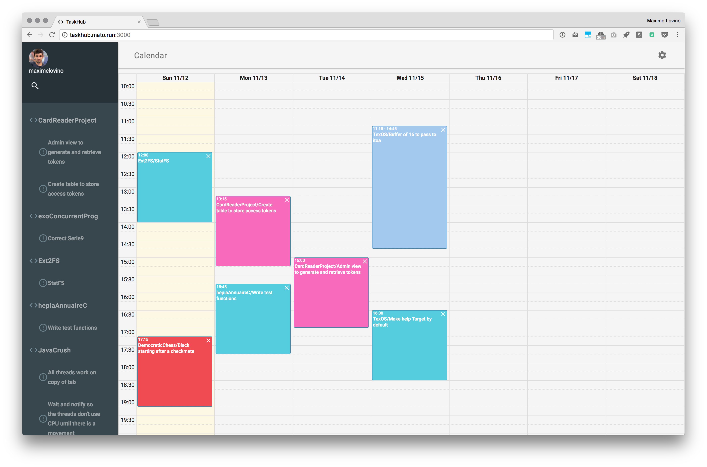

# TaskHub

Project for the [LauzHack Hackaton 2017](http://lauzhack.com/), you can check it out [here](http://taskhub.mato.run:3000/)

## What it does

TaskHub is a website allowing you to view all your GitHub issues and schedule on a calendar when you're gonna work on them.

## How we built it

Everything is written in JavaScript, we're running Node.js coupled with Express and a MariaDB database for the backend with Pug as a templating language for generating HTML/CSS/JS with Material Design Lite for the frontend. It was our first big project with Node.js and we had some difficulties at first, but in the end it turned out great.

## Accomplishments that we're proud of

Coming up with a good looking frontend and an useful application for ourselves and fellow developers.

Made with ❤️ at EPFL

Powered by RedBull, Coffee and Junk Food